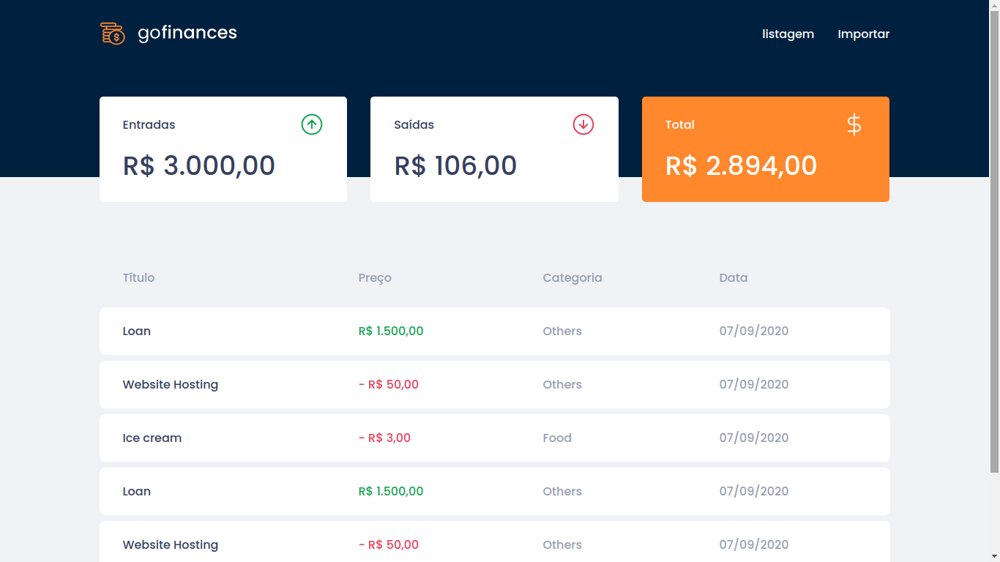

<h1 align="center">
 
Go Finances
</h1>

Application for controlling finances and uploading csv

  

## Features

This app features all the latest tools and practices in web development!

- ⚛️ **React Js** — A JavaScript library for building user interfaces
- :blue_book: **Typescript** — TypeScript provides highly productive development tools for JavaScript IDEs and practices, like static checking.
- 💹 **Node Js** — A open-source, cross-platform, JavaScript runtime environment that executes JavaScript code outside a web browser
- :blue_book: **Postgres** PostgreSQL is a powerful, open source object-relational database system with over 30 years of active development that has earned it a strong reputation for reliability, feature robustness, and performance.

## Getting started

1. Clone this repo using `git clone github.com/wellingtonn96/challenge-go-finances.git`
2. Move yourself to the appropriate directory: `cd challenge-go-finances` 
3. Run `yarn` to install dependencies

### Getting started with the backend server

1. Move yourself to the backend folder: `cd server/`
2. Create the database in the Postgres
3. Configure the database in the `ormconfig.json` file
4. Run migrations with the command `yarn typeorm migration:run`
5. Run `yarn dev:server` to start the server
6. Test the application with the command `yarn test`

### Getting started with the frontend app

1. Move yourself to the frontend folder: `cd web/`
2. Run `yarn install` to install the dependencies
3. Run `yarn start` to start the web application
1. Test the application with the command `yarn test`

## License

This project is licensed under the MIT License - see the [LICENSE](https://opensource.org/licenses/MIT) page for details.